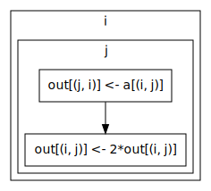
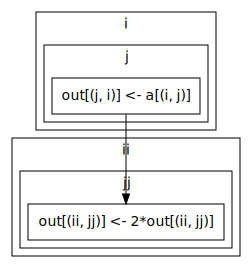
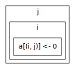

.. _tutorial:

Tutorial
========

This guide provides a gentle introduction into what loopy is, how it works,
and what it can do. There's also the :ref:`reference` that aims to
unambiguously define all aspects of loopy.

Preparation
-----------

.. {{{

:mod:`loopy` currently requires on :mod:`pyopencl` to be installed. We
import a few modules and set up a :class:`pyopencl.Context` and a
:class:`pyopencl.CommandQueue`:

.. doctest::

    >>> import numpy as np
    >>> import pyopencl as cl
    >>> import pyopencl.array
    >>> import pyopencl.clrandom

    >>> import loopy as lp
    >>> lp.set_caching_enabled(False)
    >>> from loopy.version import LOOPY_USE_LANGUAGE_VERSION_2018_2

    >>> from warnings import filterwarnings, catch_warnings
    >>> filterwarnings('error', category=lp.LoopyWarning)
    >>> from loopy.diagnostic import DirectCallUncachedWarning
    >>> filterwarnings('ignore', category=DirectCallUncachedWarning)

    >>> ctx = cl.create_some_context(interactive=False)
    >>> queue = cl.CommandQueue(ctx)

We also create some data on the device that we'll use throughout our
examples:

.. doctest::

    >>> n = 16*16
    >>> x_vec_dev = cl.clrandom.rand(queue, n, dtype=np.float32)
    >>> y_vec_dev = cl.clrandom.rand(queue, n, dtype=np.float32)
    >>> z_vec_dev = cl.clrandom.rand(queue, n, dtype=np.float32)
    >>> a_mat_dev = cl.clrandom.rand(queue, (n, n), dtype=np.float32)
    >>> b_mat_dev = cl.clrandom.rand(queue, (n, n), dtype=np.float32)

And some data on the host:

.. doctest::

    >>> x_vec_host = np.random.randn(n).astype(np.float32)
    >>> y_vec_host = np.random.randn(n).astype(np.float32)

.. }}}

We'll also disable console syntax highlighting because it confuses
doctest:

.. doctest::

    >>> # not a documented interface
    >>> import loopy.options
    >>> loopy.options.ALLOW_TERMINAL_COLORS = False

Getting started
---------------

.. {{{

We'll start by taking a closer look at a very simple kernel that reads in
one vector, doubles it, and writes it to another.

.. doctest::

    >>> knl = lp.make_kernel(
    ...     "{ [i]: 0<=i<n }",
    ...     "out[i] = 2*a[i]")

The parts that you see here are the two main components of a loopy kernel:

* The **loop domain**: ``{ [i]: 0<=i<n }``. This tells loopy the values that
  you would like your loop variables to assume. It is written in
  :ref:`isl-syntax`. Loopy calls the loop variables **inames**.  These are
  the identifiers that occur in between the brackets at the beginning of
  the loop domain.

  Note that *n* is not an iname in the example. It is a parameter that is
  passed to the kernel by the user that, in this case, determines the
  length of the vector being multiplied.

* The **instructions** to be executed. These are generally scalar
  assignments between array elements, consisting of a left hand
  side and a right hand side. See :ref:`assignments` for the
  full syntax of an assignment.

  Reductions are allowed, too, and are given as, for example::

    sum(k, a[i,k]*b[k,j])

  See :ref:`expression-syntax` for a full list of allowed constructs in the
  left- and right-hand side expression of an assignment.

As you create and transform kernels, it's useful to know that you can
always see loopy's view of a kernel by printing it.

.. doctest::

    >>> knl = lp.set_options(knl, allow_terminal_colors=False)
    >>> print(knl)
    ---------------------------------------------------------------------------
    KERNEL: loopy_kernel
    ---------------------------------------------------------------------------
    ARGUMENTS:
    a: type: <auto/runtime>, shape: (n), dim_tags: (N0:stride:1) in aspace: global
    n: ValueArg, type: <auto/runtime>
    out: type: <auto/runtime>, shape: (n), dim_tags: (N0:stride:1) out aspace: global
    ---------------------------------------------------------------------------
    DOMAINS:
    [n] -> { [i] : 0 <= i < n }
    ---------------------------------------------------------------------------
    INAME TAGS:
    i: None
    ---------------------------------------------------------------------------
    INSTRUCTIONS:
    for i
      out[i] = 2*a[i]  {id=insn}
    end i
    ---------------------------------------------------------------------------

You'll likely have noticed that there's quite a bit more information here
than there was in the input. Most of this comes from default values that
loopy assumes to cover common use cases. These defaults can all be
overridden.

We've seen the domain and the instructions above, and we'll discuss the
'iname-to-tag-map' in :ref:`implementing-inames`. The remaining big chunk
of added information is in the 'arguments' section, where we observe the
following:

* ``a`` and ``out`` have been classified as pass-by-reference (i.e.
  pointer) arguments in global device memory. Any referenced array variable
  will default to global unless otherwise specified.

* Loopy has also examined our access to ``a`` and ``out`` and determined
  the bounds of the array from the values we are accessing. This is shown
  after **shape:**. Like :mod:`numpy`, loopy works on multi-dimensional
  arrays. Loopy's idea of arrays is very similar to that of :mod:`numpy`,
  including the *shape* attribute.

  Sometimes, loopy will be unable to make this determination. It will tell
  you so--for example when the array indices consist of data read from
  memory.  Other times, arrays are larger than the accessed footprint. In
  either case, you will want to specify the kernel arguments explicitly.
  See :ref:`specifying-arguments`.

* Loopy has not determined the type of ``a`` and ``out``. The data type is
  given as ``<auto/runtime>``, which means that these types will be determined
  by the data passed in when the kernel is invoked. Loopy generates (and
  caches!) a copy of the kernel for each combination of types passed in.

* In addition, each array axis has a 'dimension tag'. This is shown above
  as ``(stride:1)``. We will see more on this in
  :ref:`implementing-array-axes`.

.. }}}

Running a kernel
----------------

.. {{{

Running the kernel that we've just created is easy. Let's check the result
for good measure.

.. doctest::

    >>> evt, (out,) = knl(queue, a=x_vec_dev)
    >>> assert (out.get() == (2*x_vec_dev).get()).all()

We can have loopy print the OpenCL kernel it generated
by passing :attr:`loopy.Options.write_code`.

.. doctest::

    >>> knl = lp.set_options(knl, write_code=True)
    >>> evt, (out,) = knl(queue, a=x_vec_dev)
    #define lid(N) ((int) get_local_id(N))
    #define gid(N) ((int) get_group_id(N))
    <BLANKLINE>
    __kernel void __attribute__ ((reqd_work_group_size(1, 1, 1))) loopy_kernel(__global float const *__restrict__ a, int const n, __global float *__restrict__ out)
    {
      for (int i = 0; i <= -1 + n; ++i)
        out[i] = 2.0f * a[i];
    }

As promised, loopy has used the type of *x_vec_dev* to specialize the
kernel. If a variable is written as part of the kernel code, loopy will
automatically return it in the second element of the result of a kernel
call (the first being the :class:`pyopencl.Event` associated with the
execution of the kernel). (If the ordering of the output tuple is not
clear, it can be specified or turned into a :class:`dict`. See the
*kernel_data* argument of :func:`loopy.make_kernel` and
:attr:`loopy.Options.return_dict`.)

For convenience, loopy kernels also directly accept :mod:`numpy` arrays:

.. doctest::

    >>> evt, (out,) = knl(queue, a=x_vec_host)
    >>> assert (out == (2*x_vec_host)).all()

Notice how both *out* and *a* are :mod:`numpy` arrays, but neither needed
to be transferred to or from the device.  Checking for numpy arrays and
transferring them if needed comes at a potential performance cost.  If you
would like to make sure that you avoid this cost, pass
:attr:`loopy.Options.no_numpy`.

Further notice how *n*, while technically being an argument, did not need
to be passed, as loopy is able to find *n* from the shape of the input
argument *a*.

For efficiency, loopy generates Python code that handles kernel invocation.
If you are suspecting that this code is causing you an issue, you can
inspect that code, too, using :attr:`loopy.Options.write_wrapper`:

.. doctest::

    >>> knl = lp.set_options(knl, write_wrapper=True, write_code=False)
    >>> evt, (out,) = knl(queue, a=x_vec_host)
    import numpy as _lpy_np
    ...
    def invoke_loopy_kernel_loopy_kernel(_lpy_cl_kernels, queue, allocator=None, wait_for=None, out_host=None, a=None, n=None, out=None):
        if allocator is None:
            allocator = _lpy_cl_tools.DeferredAllocator(queue.context)
    <BLANKLINE>
        # {{{ find integer arguments from array data
    <BLANKLINE>
        if n is None:
            if a is not None:
                n = a.shape[0]
            elif out is not None:
                n = out.shape[0]
    <BLANKLINE>
        # }}}
    ...

You can also pass options to the OpenCL implementation
by passing :attr:`loopy.Options.build_options`.

.. doctest::

    >>> knl = lp.set_options(knl, build_options=["-cl-mad-enable"])

Generating code
~~~~~~~~~~~~~~~

Instead of using loopy to run the code it generates, you can also just use
loopy as a code generator and take care of executing the generated kernels
yourself. In this case, make sure loopy knows about all types, and then
call :func:`loopy.generate_code_v2`:

.. doctest::

    >>> typed_knl = lp.add_dtypes(knl, dict(a=np.float32))
    >>> code = lp.generate_code_v2(typed_knl).device_code()
    >>> print(code)
    #define lid(N) ((int) get_local_id(N))
    #define gid(N) ((int) get_group_id(N))
    <BLANKLINE>
    __kernel void __attribute__ ((reqd_work_group_size(1, 1, 1))) loopy_kernel(__global float const *__restrict__ a, int const n, __global float *__restrict__ out)
    {
      for (int i = 0; i <= -1 + n; ++i)
        out[i] = 2.0f * a[i];
    }

Additionally, for C-based languages, header definitions can be obtained via
the :func:`loopy.generate_header`:

.. doctest::

    >>> header = str(lp.generate_header(typed_knl)[0])
    >>> print(header)
    __kernel void __attribute__ ((reqd_work_group_size(1, 1, 1))) loopy_kernel(__global float const *__restrict__ a, int const n, __global float *__restrict__ out);

.. }}}

.. _ordering:

Ordering
--------

.. {{{

Next, we'll change our kernel a bit. Our goal will be to transpose a matrix
and double its entries, and we will do this in two steps for the sake of
argument:

.. doctest::

    >>> # WARNING: Incorrect.
    >>> knl = lp.make_kernel(
    ...     "{ [i,j]: 0<=i,j<n }",
    ...     """
    ...     out[j,i] = a[i,j]
    ...     out[i,j] = 2*out[i,j]
    ...     """,
    ...     [lp.GlobalArg("out", shape=lp.auto, is_input=False), ...])

loopy's programming model is completely *unordered* by default. This means
that:

* There is no guarantee about the order in which the loop domain is
  traversed. ``i==3`` could be reached before ``i==0`` but also before
  ``i==17``. Your program is only correct if it produces a valid result
  irrespective of this ordering.

* In addition, there is (by default) no ordering between instructions
  either. In other words, loopy is free to execute the instructions above
  in any order whatsoever.

Reading the above two rules, you'll notice that our transpose-and-multiply
kernel is incorrect, because it only computes the desired result if the
first instruction completes before the second one. To fix this, we declare
an explicit dependency:

.. doctest::

    >>> # WARNING: Incorrect.
    >>> knl = lp.make_kernel(
    ...     "{ [i,j]: 0<=i,j<n }",
    ...     """
    ...     out[j,i] = a[i,j] {id=transpose}
    ...     out[i,j] = 2*out[i,j]  {dep=transpose}
    ...     """,
    ...     [lp.GlobalArg("out", shape=lp.auto, is_input=False), ...],
    ...     name="transpose_and_dbl")

``{id=transpose}`` assigns the identifier *transpose* to the first
instruction, and ``{dep=transpose}`` declares a dependency of the second
instruction on the first. Looking at loopy's view of this kernel, we see
that these dependencies show up there, too:

.. doctest::

    >>> print(knl["transpose_and_dbl"].stringify(with_dependencies=True))
    ---------------------------------------------------------------------------
    KERNEL: transpose_and_dbl
    ---------------------------------------------------------------------------
    ...
    ---------------------------------------------------------------------------
    DEPENDENCIES: (use loopy.show_dependency_graph to visualize)
    insn : transpose
    ---------------------------------------------------------------------------

These dependencies are in a ``dependent : prerequisite`` format that should
be familiar if you have previously dealt with Makefiles. For larger
kernels, these dependency lists can become quite verbose, and there is an
increasing risk that required dependencies are missed. To help catch these,
loopy can also show an instruction dependency graph, using
:func:`loopy.show_dependency_graph`:

Dependencies are shown as arrows from prerequisite to dependent in the
graph.  This functionality requires the open-source `graphviz
<https://graphviz.org>`_ graph drawing tools to be installed. The generated
graph will open in a browser window.

Since manually notating lots of dependencies is cumbersome, loopy has
a heuristic:

    If a variable is written by exactly one instruction, then all
    instructions reading that variable will automatically depend on the
    writing instruction.

The intent of this heuristic is to cover the common case of a
precomputed result being stored and used many times. Generally, these
dependencies are *in addition* to any manual dependencies added via
``{dep=...}``.  It is possible (but rare) that the heuristic adds undesired
dependencies.  In this case, ``{dep=*...}`` (i.e. a leading asterisk) to
prevent the heuristic from adding dependencies for this instruction.

Loops and dependencies
~~~~~~~~~~~~~~~~~~~~~~

Next, it is important to understand how loops and dependencies interact.
Let us take a look at the generated code for the above kernel:

.. doctest::

    >>> knl = lp.set_options(knl, write_code=True)
    >>> knl = lp.prioritize_loops(knl, "i,j")
    >>> evt, (out,) = knl(queue, a=a_mat_dev)
    #define lid(N) ((int) get_local_id(N))
    #define gid(N) ((int) get_group_id(N))
    <BLANKLINE>
    __kernel void __attribute__ ((reqd_work_group_size(1, 1, 1))) transpose_and_dbl(__global float *__restrict__ out, __global float const *__restrict__ a, int const n)
    {
      for (int i = 0; i <= -1 + n; ++i)
        for (int j = 0; j <= -1 + n; ++j)
        {
          out[n * j + i] = a[n * i + j];
          out[n * i + j] = 2.0f * out[n * i + j];
        }
    }

While our requested instruction ordering has been obeyed, something is
still not right:

.. doctest::

    >>> print((out.get() == a_mat_dev.get().T*2).all())
    False

For the kernel to perform the desired computation, *all
instances* (loop iterations) of the first instruction need to be completed,
not just the one for the current values of *(i, j)*.

    Dependencies in loopy act *within* the largest common set of shared
    inames.

As a result, our example above realizes the dependency *within* the *i* and *j*
loops. To fix our example, we simply create a new pair of loops *ii* and *jj*
with identical bounds, for the use of the transpose:

.. doctest::

    >>> knl = lp.make_kernel(
    ...     "{ [i,j,ii,jj]: 0<=i,j,ii,jj<n }",
    ...     """
    ...     out[j,i] = a[i,j] {id=transpose}
    ...     out[ii,jj] = 2*out[ii,jj]  {dep=transpose}
    ...     """,
    ...     [lp.GlobalArg("out", shape=lp.auto, is_input=False), ...])
    >>> knl = lp.prioritize_loops(knl, "i,j,ii,jj")

:func:`loopy.duplicate_inames` can be used to achieve the same goal.
Now the intended code is generated and our test passes.

.. doctest::

    >>> knl = lp.set_options(knl, write_code=True)
    >>> evt, (out,) = knl(queue, a=a_mat_dev)
    #define lid(N) ((int) get_local_id(N))
    #define gid(N) ((int) get_group_id(N))
    <BLANKLINE>
    __kernel void __attribute__ ((reqd_work_group_size(1, 1, 1))) loopy_kernel(__global float *__restrict__ out, __global float const *__restrict__ a, int const n)
    {
      for (int i = 0; i <= -1 + n; ++i)
        for (int j = 0; j <= -1 + n; ++j)
          out[n * j + i] = a[n * i + j];
      for (int ii = 0; ii <= -1 + n; ++ii)
        for (int jj = 0; jj <= -1 + n; ++jj)
          out[n * ii + jj] = 2.0f * out[n * ii + jj];
    }
    >>> assert (out.get() == a_mat_dev.get().T*2).all()

Also notice how the changed loop structure is reflected in the dependency
graph:

Loop nesting
~~~~~~~~~~~~

One last aspect of ordering over which we have thus far not exerted any
control is the nesting of loops. For example, should the *i* loop be nested
around the *j* loop, or the other way around, in the following simple
zero-fill kernel?

It turns out that Loopy will choose a loop nesting for us, but it might be
ambiguous. Consider the following code:

.. doctest::

    >>> knl = lp.make_kernel(
    ...     "{ [i,j]: 0<=i,j<n }",
    ...     """
    ...     a[i,j] = 0
    ...     """)

Both nestings of the inames `i` and `j` result in a correct kernel.
This ambiguity can be resolved:

.. doctest::

    >>> knl = lp.prioritize_loops(knl, "j,i")

:func:`loopy.prioritize_loops` indicates the textual order in which loops
should be entered in the kernel code.  Note that this priority has an
advisory role only. If the kernel logically requires a different nesting,
loop priority is ignored.  Priority is only considered if loop nesting is
ambiguous.

.. doctest::

    >>> knl = lp.set_options(knl, write_code=True)
    >>> evt, (out,) = knl(queue, a=a_mat_dev)
    #define lid(N) ((int) get_local_id(N))
    ...
      for (int j = 0; j <= -1 + n; ++j)
        for (int i = 0; i <= -1 + n; ++i)
          a[n * i + j] = 0.0f;
    ...

No more warnings! Loop nesting is also reflected in the dependency graph:

.. }}}

.. _intro-transformations:

Introduction to Kernel Transformations
--------------------------------------

.. {{{

What we have covered thus far puts you in a position to describe many kinds
of computations to loopy--in the sense that loopy will generate code that
carries out the correct operation. That's nice, but it's natural to also
want control over *how* a program is executed. Loopy's way of capturing
this information is by way of *transformations*. These have the following
general shape::

    new_kernel = lp.do_something(old_knl, arguments...)

These transformations always return a *copy* of the old kernel with the
requested change applied. Typically, the variable holding the old kernel
is overwritten with the new kernel::

    knl = lp.do_something(knl, arguments...)

We've already seen an example of a transformation above:
For instance, :func:`loopy.prioritize_loops` fit the pattern.

:func:`loopy.split_iname` is another fundamental (and useful) transformation. It
turns one existing iname (recall that this is loopy's word for a 'loop
variable', roughly) into two new ones, an 'inner' and an 'outer' one,
where the 'inner' loop is of a fixed, specified length, and the 'outer'
loop runs over these fixed-length 'chunks'. The three inames have the
following relationship to one another::

    OLD = INNER + GROUP_SIZE * OUTER

Consider this example:

.. doctest::

    >>> knl = lp.make_kernel(
    ...     "{ [i]: 0<=i<n }",
    ...     "a[i] = 0", assumptions="n>=1")
    >>> knl = lp.split_iname(knl, "i", 16)
    >>> knl = lp.prioritize_loops(knl, "i_outer,i_inner")
    >>> knl = lp.set_options(knl, write_code=True)
    >>> evt, (out,) = knl(queue, a=x_vec_dev)
    #define lid(N) ((int) get_local_id(N))
    ...
      for (int i_outer = 0; i_outer <= -1 + (15 + n) / 16; ++i_outer)
        for (int i_inner = 0; i_inner <= ((-17 + n + -16 * i_outer >= 0) ? 15 : -1 + n + -16 * i_outer); ++i_inner)
          a[16 * i_outer + i_inner] = 0.0f;
    ...

By default, the new, split inames are named *OLD_outer* and *OLD_inner*,
where *OLD* is the name of the previous iname. Upon exit from
:func:`loopy.split_iname`, *OLD* is removed from the kernel and replaced by
*OLD_inner* and *OLD_outer*.

Also take note of the *assumptions* argument. This makes it possible to
communicate assumptions about loop domain parameters. (but *not* about
data) In this case, assuming non-negativity helps loopy generate more
efficient code for division in the loop bound for *i_outer*. See below
on how to communicate divisibility assumptions.

Note that the words 'inner' and 'outer' here have no implied meaning in
relation to loop nesting. For example, it's perfectly possible to request
*i_inner* to be nested outside *i_outer*:

.. doctest::

    >>> knl = lp.make_kernel(
    ...     "{ [i]: 0<=i<n }",
    ...     "a[i] = 0", assumptions="n>=1")
    >>> knl = lp.split_iname(knl, "i", 16)
    >>> knl = lp.prioritize_loops(knl, "i_inner,i_outer")
    >>> knl = lp.set_options(knl, write_code=True)
    >>> evt, (out,) = knl(queue, a=x_vec_dev)
    #define lid(N) ((int) get_local_id(N))
    ...
      for (int i_inner = 0; i_inner <= ((-17 + n >= 0) ? 15 : -1 + n); ++i_inner)
        for (int i_outer = 0; i_outer <= -1 + -1 * i_inner + (15 + n + 15 * i_inner) / 16; ++i_outer)
          a[16 * i_outer + i_inner] = 0.0f;
    ...

Notice how loopy has automatically generated guard conditionals to make
sure the bounds on the old iname are obeyed.

The combination of :func:`loopy.split_iname` and
:func:`loopy.prioritize_loops` is already good enough to implement what is
commonly called 'loop tiling':

.. doctest::

    >>> knl = lp.make_kernel(
    ...     "{ [i,j]: 0<=i,j<n }",
    ...     "out[i,j] = a[j,i]",
    ...     assumptions="n mod 16 = 0 and n >= 1")
    >>> knl = lp.split_iname(knl, "i", 16)
    >>> knl = lp.split_iname(knl, "j", 16)
    >>> knl = lp.prioritize_loops(knl, "i_outer,j_outer,i_inner")
    >>> knl = lp.set_options(knl, write_code=True)
    >>> evt, (out,) = knl(queue, a=a_mat_dev)
    #define lid(N) ((int) get_local_id(N))
    ...
      for (int i_outer = 0; i_outer <= (-16 + n) / 16; ++i_outer)
        for (int j_outer = 0; j_outer <= (-16 + n) / 16; ++j_outer)
          for (int i_inner = 0; i_inner <= 15; ++i_inner)
            for (int j_inner = 0; j_inner <= 15; ++j_inner)
              out[n * (16 * i_outer + i_inner) + 16 * j_outer + j_inner] = a[n * (16 * j_outer + j_inner) + 16 * i_outer + i_inner];
    ...

.. }}}

.. _implementing-inames:

Implementing Loop Axes ("Inames")
---------------------------------

.. {{{

So far, all the loops we have seen loopy implement were ``for`` loops. Each
iname in loopy carries a so-called 'implementation tag'.  :ref:`iname-tags` shows
all possible choices for iname implementation tags. The important ones are
explained below.

Unrolling
~~~~~~~~~

Our first example of an 'implementation tag' is ``"unr"``, which performs
loop unrolling.  Let us split the main loop of a vector fill kernel into
chunks of 4 and unroll the fixed-length inner loop by setting the inner
loop's tag to ``"unr"``:

.. doctest::

    >>> knl = lp.make_kernel(
    ...     "{ [i]: 0<=i<n }",
    ...     "a[i] = 0", assumptions="n>=0 and n mod 4 = 0")
    >>> orig_knl = knl
    >>> knl = lp.split_iname(knl, "i", 4)
    >>> knl = lp.tag_inames(knl, dict(i_inner="unr"))
    >>> knl = lp.prioritize_loops(knl, "i_outer,i_inner")
    >>> knl = lp.set_options(knl, write_code=True)
    >>> evt, (out,) = knl(queue, a=x_vec_dev)
    #define lid(N) ((int) get_local_id(N))
    #define gid(N) ((int) get_group_id(N))
    ...
      for (int i_outer = 0; i_outer <= loopy_floor_div_pos_b_int32(-4 + n, 4); ++i_outer)
      {
        a[4 * i_outer] = 0.0f;
        a[1 + 4 * i_outer] = 0.0f;
        a[2 + 4 * i_outer] = 0.0f;
        a[3 + 4 * i_outer] = 0.0f;
      }
    ...

:func:`loopy.tag_inames` is a new transformation that assigns
implementation tags to kernels.  ``"unr"`` is the first tag we've
explicitly learned about. Technically, though, it is the second--``"for"``
(or, equivalently, *None*), which is the default, instructs loopy to
implement an iname using a for loop.

Unrolling obviously only works for inames with a fixed maximum number of
values, since only a finite amount of code can be generated. Unrolling the
entire *i* loop in the kernel above would not work.

Split-and-tag
~~~~~~~~~~~~~

Since split-and-tag is such a common combination, :func:`loopy.split_iname`
provides a shortcut:

.. doctest::

    >>> knl = orig_knl
    >>> knl = lp.split_iname(knl, "i", 4, inner_tag="unr")

The *outer_tag* keyword argument exists, too, and works just like you would
expect.

Printing
~~~~~~~~

Iname implementation tags are also printed along with the entire kernel:

.. doctest::

    >>> print(knl)
    ---------------------------------------------------------------------------
    ...
    INAME TAGS:
    i_inner: unr
    i_outer: None
    ---------------------------------------------------------------------------
    ...

Parallelization
~~~~~~~~~~~~~~~

Loops are also parallelized in loopy by assigning them parallelizing
implementation tags. In OpenCL, this means that the loop variable
corresponds to either a local ID or a workgroup ID. The implementation tags
for local IDs are ``"l.0"``, ``"l.1"``, ``"l.2"``, and so on.  The
corresponding tags for group IDs are ``"g.0"``, ``"g.1"``, ``"g.2"``, and
so on.

Let's try this out on our vector fill kernel by creating workgroups of size
128:

.. doctest::

    >>> knl = lp.make_kernel(
    ...     "{ [i]: 0<=i<n }",
    ...     "a[i] = 0", assumptions="n>=0")
    >>> knl = lp.split_iname(knl, "i", 128,
    ...         outer_tag="g.0", inner_tag="l.0")
    >>> knl = lp.set_options(knl, write_code=True)
    >>> evt, (out,) = knl(queue, a=x_vec_dev)
    #define lid(N) ((int) get_local_id(N))
    ...
    __kernel void __attribute__ ((reqd_work_group_size(128, 1, 1))) loopy_kernel(__global float *__restrict__ a, int const n)
    {
      if (-1 + -128 * gid(0) + -1 * lid(0) + n >= 0)
        a[128 * gid(0) + lid(0)] = 0.0f;
    }

Loopy requires that workgroup sizes are fixed and constant at compile time.
By comparison, the overall execution ND-range size (i.e. the number of
workgroups) is allowed to be runtime-variable.

Note how there was no need to specify group or range sizes. Loopy computes
those for us:

.. doctest::

    >>> glob, loc = knl["loopy_kernel"].get_grid_size_upper_bounds(knl.callables_table)
    >>> print(glob)
    (PwAff("[n] -> { [(floor((127 + n)/128))] }"),)
    >>> print(loc)
    (PwAff("[n] -> { [(128)] }"),)

Note that this functionality returns internal objects and is not really
intended for end users.

Avoiding Conditionals
~~~~~~~~~~~~~~~~~~~~~

You may have observed above that we have used a divisibility assumption on
*n* in the kernels above. Without this assumption, loopy would generate
conditional code to make sure no out-of-bounds loop instances are executed.
This here is the original unrolling example without the divisibility
assumption:

.. doctest::

    >>> knl = lp.make_kernel(
    ...     "{ [i]: 0<=i<n }",
    ...     "a[i] = 0", assumptions="n>=0")
    >>> orig_knl = knl
    >>> knl = lp.split_iname(knl, "i", 4)
    >>> knl = lp.tag_inames(knl, dict(i_inner="unr"))
    >>> knl = lp.prioritize_loops(knl, "i_outer,i_inner")
    >>> knl = lp.set_options(knl, write_code=True)
    >>> evt, (out,) = knl(queue, a=x_vec_dev)
    #define lid(N) ((int) get_local_id(N))
    ...
      for (int i_outer = 0; i_outer <= -1 + (3 + n) / 4; ++i_outer)
      {
        a[4 * i_outer] = 0.0f;
        if (-2 + -4 * i_outer + n >= 0)
          a[1 + 4 * i_outer] = 0.0f;
        if (-3 + -4 * i_outer + n >= 0)
          a[2 + 4 * i_outer] = 0.0f;
        if (-4 + -4 * i_outer + n >= 0)
          a[3 + 4 * i_outer] = 0.0f;
      }
    ...

While these conditionals enable the generated code to deal with arbitrary
*n*, they come at a performance cost. Loopy allows generating separate code
for the last iteration of the *i_outer* loop, by using the *slabs* keyword
argument to :func:`loopy.split_iname`. Since this last iteration of *i_outer* is
the only iteration for which ``i_inner + 4*i_outer`` can become larger than
*n*, only the (now separate) code for that iteration contains conditionals,
enabling some cost savings:

.. doctest::

    >>> knl = orig_knl
    >>> knl = lp.split_iname(knl, "i", 4, slabs=(0, 1), inner_tag="unr")
    >>> knl = lp.set_options(knl, write_code=True)
    >>> knl = lp.prioritize_loops(knl, "i_outer,i_inner")
    >>> evt, (out,) = knl(queue, a=x_vec_dev)
    #define lid(N) ((int) get_local_id(N))
    ...
      /* bulk slab for 'i_outer' */
      for (int i_outer = 0; i_outer <= -2 + (3 + n) / 4; ++i_outer)
      {
        a[4 * i_outer] = 0.0f;
        a[1 + 4 * i_outer] = 0.0f;
        a[2 + 4 * i_outer] = 0.0f;
        a[3 + 4 * i_outer] = 0.0f;
      }
      /* final slab for 'i_outer' */
      {
        int const i_outer = -1 + n + -1 * ((3 * n) / 4);
    <BLANKLINE>
        if (-1 + n >= 0)
        {
          a[4 * i_outer] = 0.0f;
          if (-2 + -4 * i_outer + n >= 0)
            a[1 + 4 * i_outer] = 0.0f;
          if (-3 + -4 * i_outer + n >= 0)
            a[2 + 4 * i_outer] = 0.0f;
          if (4 + 4 * i_outer + -1 * n == 0)
            a[3 + 4 * i_outer] = 0.0f;
        }
      }
    ...

.. }}}

.. _specifying-arguments:

Specifying arguments
--------------------

* Kinds: global, constant, value
* Types

.. _argument-shapes:

Argument shapes
~~~~~~~~~~~~~~~

Shapes (and automatic finding thereof)

.. _implementing-array-axes:

Implementing Array Axes
~~~~~~~~~~~~~~~~~~~~~~~

Precomputation, Storage, and Temporary Variables
------------------------------------------------

.. {{{

The loopy kernels we have seen thus far have consisted only of assignments
from one global-memory storage location to another. Sometimes, computation
results obviously get reused, so that recomputing them or even just
re-fetching them from global memory becomes uneconomical. Loopy has
a number of different ways of addressing this need.

Explicit private temporaries
~~~~~~~~~~~~~~~~~~~~~~~~~~~~

The simplest of these ways is the creation of an explicit temporary
variable, as one might do in C or another programming language:

.. doctest::

    >>> knl = lp.make_kernel(
    ...     "{ [i]: 0<=i<n }",
    ...     """
    ...     <float32> a_temp = sin(a[i])
    ...     out1[i] = a_temp {id=out1}
    ...     out2[i] = sqrt(1-a_temp*a_temp) {dep=out1}
    ...     """)

The angle brackets ``<>`` denote the creation of a temporary. The name of
the temporary may not override inames, argument names, or other names in
the kernel. The name in between the angle brackets is a typename as
understood by the type registry :mod:`pyopencl.array`. To first order,
the conventional :mod:`numpy` scalar types (:class:`numpy.int16`,
:class:`numpy.complex128`) will work. (Yes, :mod:`loopy` supports and
generates correct code for complex arithmetic.)

(If you're wondering, the dependencies above were added to make the doctest
produce predictable output.)

The generated code places this variable into what OpenCL calls 'private'
memory, local to each work item.

.. doctest::

    >>> knl = lp.set_options(knl, write_code=True)
    >>> evt, (out1, out2) = knl(queue, a=x_vec_dev)
    #define lid(N) ((int) get_local_id(N))
    ...
    {
      float a_temp;
    <BLANKLINE>
      for (int i = 0; i <= -1 + n; ++i)
      {
        a_temp = sin(a[i]);
        out1[i] = a_temp;
        out2[i] = sqrt(1.0f + -1.0f * a_temp * a_temp);
      }
    }

Type inference for temporaries
~~~~~~~~~~~~~~~~~~~~~~~~~~~~~~

Most :mod:`loopy` code can be written so as to be type-generic (with types
determined by parameters passed at run time). The same is true for
temporary variables--specifying a type for the variable is optional. As you
can see in the code below, angle brackets alone denote that a temporary
should be created, and the type of the variable will be deduced from the
expression being assigned.

.. doctest::

    >>> knl = lp.make_kernel(
    ...     "{ [i]: 0<=i<n }",
    ...     """
    ...     <> a_temp = sin(a[i])
    ...     out1[i] = a_temp
    ...     out2[i] = sqrt(1-a_temp*a_temp)
    ...     """)
    >>> evt, (out1, out2) = knl(queue, a=x_vec_dev)

.. _local_temporaries:

Temporaries in local memory
~~~~~~~~~~~~~~~~~~~~~~~~~~~

In most situations, :mod:`loopy` will  automatically deduce whether a given
temporary should be placed into local or private storage. If the variable
is ever written to in parallel and indexed by expressions containing local
IDs, then it is marked as residing in local memory. If this heuristic is
insufficient, :class:`loopy.TemporaryVariable` instances can be marked
local manually.

Consider the following example:

.. doctest::

    >>> knl = lp.make_kernel(
    ...     "{ [i_outer,i_inner, k]:  "
    ...          "0<= 16*i_outer + i_inner <n and 0<= i_inner,k <16}",
    ...     """
    ...     <> a_temp[i_inner] = a[16*i_outer + i_inner] {priority=10}
    ...     out[16*i_outer + i_inner] = sum(k, a_temp[k])
    ...     """)
    >>> knl = lp.tag_inames(knl, dict(i_outer="g.0", i_inner="l.0"))
    >>> knl = lp.set_temporary_address_space(knl, "a_temp", "local")
    >>> knl = lp.set_options(knl, write_code=True)
    >>> evt, (out,) = knl(queue, a=x_vec_dev)
    #define lid(N) ((int) get_local_id(N))
    ...
    {
      __local float a_temp[16];
      float acc_k;
    <BLANKLINE>
      if (-1 + -16 * gid(0) + -1 * lid(0) + n >= 0)
      {
        a_temp[lid(0)] = a[16 * gid(0) + lid(0)];
        acc_k = 0.0f;
      }
      barrier(CLK_LOCAL_MEM_FENCE) /* for a_temp (insn_0_k_update depends on insn) */;
      if (-1 + -16 * gid(0) + -1 * lid(0) + n >= 0)
      {
        for (int k = 0; k <= 15; ++k)
          acc_k = acc_k + a_temp[k];
        out[16 * gid(0) + lid(0)] = acc_k;
      }
    }

Observe that *a_temp* was automatically placed in local memory, because
it is written in parallel across values of the group-local iname
*i_inner*. In addition, :mod:`loopy` has emitted a barrier instruction to
achieve the :ref:`ordering` specified by the instruction dependencies.

(The ``priority=10`` attribute was added to make the output of the test
deterministic.)

.. note::

    It is worth noting that it was not necessary to provide a size for the
    temporary ``a_temp``. :mod:`loopy` deduced the size to be allocated (16
    entries in this case) from the indices being accessed. This works just
    as well for 2D and 3D temporaries.

    The mechanism for finding accessed indices is the same as described
    in :ref:`argument-shapes`.

    If the size-finding heuristic fails or is impractical to use, the of
    the temporary can be specified by explicitly creating a
    :class:`loopy.TemporaryVariable`.

    Note that the size of local temporaries must, for now, be a constant at
    compile time.

Prefetching
~~~~~~~~~~~

The above code example may have struck you as 'un-loopy-ish' in the sense
that whether the contents of *a* is loaded into an temporary should be
considered an implementation detail that is taken care of by a
transformation rather than being baked into the code. Indeed, such a
transformation exists in :func:`loopy.add_prefetch`:

.. doctest::

    >>> knl = lp.make_kernel(
    ...     "{ [i_outer,i_inner, k]:  "
    ...          "0<= 16*i_outer + i_inner <n and 0<= i_inner,k <16}",
    ...     """
    ...     out[16*i_outer + i_inner] = sum(k, a[16*i_outer + i_inner])
    ...     """)
    >>> knl = lp.tag_inames(knl, dict(i_outer="g.0", i_inner="l.0"))
    >>> knl = lp.set_options(knl, write_code=True)
    >>> knl_pf = lp.add_prefetch(knl, "a")
    >>> evt, (out,) = knl_pf(queue, a=x_vec_dev)
    #define lid(N) ((int) get_local_id(N))
    ...
        acc_k = 0.0f;
        a_fetch = a[16 * gid(0) + lid(0)];
        for (int k = 0; k <= 15; ++k)
          acc_k = acc_k + a_fetch;
        out[16 * gid(0) + lid(0)] = acc_k;
    ...

This is not the same as our previous code and, in this scenario, a little
bit useless, because each entry of *a* is 'pre-fetched', used, and then
thrown away. (But realize that this could perhaps be useful in other
situations when the same entry of *a* is accessed multiple times.)

What's missing is that we need to tell :mod:`loopy` that we would like to
fetch the *access footprint* of an entire loop--in this case, of *i_inner*,
as the second argument of :func:`loopy.add_prefetch`. We thus arrive back
at the same code with a temporary in local memory that we had generated
earlier:

.. doctest::

    >>> knl_pf = lp.add_prefetch(knl, "a", ["i_inner"], default_tag="l.0")
    >>> evt, (out,) = knl_pf(queue, a=x_vec_dev)
    #define lid(N) ((int) get_local_id(N))
    ...
      if (-1 + -16 * gid(0) + -1 * lid(0) + n >= 0)
        acc_k = 0.0f;
      if (-1 + -16 * gid(0) + -1 * lid(0) + n >= 0)
        a_fetch[lid(0)] = a[16 * gid(0) + lid(0)];
      if (-1 + -16 * gid(0) + -1 * lid(0) + n >= 0)
      {
        for (int k = 0; k <= 15; ++k)
          acc_k = acc_k + a_fetch[lid(0)];
        out[16 * gid(0) + lid(0)] = acc_k;
      }
    ...

Tagged prefetching
~~~~~~~~~~~~~~~~~~

.. _global_temporaries:

Temporaries in global memory
~~~~~~~~~~~~~~~~~~~~~~~~~~~~

:mod:`loopy` supports using temporaries with global storage duration. As with
local and private temporaries, the runtime allocates storage for global
temporaries when the kernel gets executed. The user must explicitly specify that
a temporary is global. To specify that a temporary is global, use
:func:`loopy.set_temporary_address_space`.

Substitution rules
~~~~~~~~~~~~~~~~~~

Generic Precomputation
~~~~~~~~~~~~~~~~~~~~~~

.. }}}

.. _synchronization:

Synchronization
---------------

.. {{{

When one work item executing with others writes to a memory location, OpenCL
does not guarantee that other work items will immediately be able to read the
memory location and get back the same thing that was written. In order to ensure
that memory is consistent across work items, some sort of synchronization
operation is used.

:mod:`loopy` supports synchronization in the form of *barriers* or *atomic
operations*.

Barriers
~~~~~~~~

Prior to code generation, :mod:`loopy` performs a check to see that every memory
access is free of dependencies requiring a barrier. The following kinds of
memory access dependencies require a barrier when they involve more than one
work item:

* read-after-write
* write-after-read
* write-after-write.

:mod:`loopy` supports two kinds of barriers:

* *Local barriers* ensure consistency of memory accesses to items within
  *the same* work group. This synchronizes with all instructions in the work
  group.  The type of memory (local or global) may be specified by the
  :attr:`loopy.BarrierInstruction.mem_kind`

* *Global barriers* ensure consistency of memory accesses
  across *all* work groups, i.e. it synchronizes with every work item
  executing the kernel. Note that there is no exact equivalent for
  this kind of barrier in OpenCL. [#global-barrier-note]_

Once a work item has reached a barrier, it waits for everyone that it
synchronizes with to reach the barrier before continuing. This means that unless
all work items reach the same barrier, the kernel will hang during execution.

Barrier insertion
~~~~~~~~~~~~~~~~~

By default, :mod:`loopy` inserts local barriers between two instructions when it
detects that a dependency involving local memory may occur across work items. To
see this in action, take a look at the section on :ref:`local_temporaries`.

In contrast, :mod:`loopy` will *not* insert global barriers automatically and
instead will report an error if it detects the need for a global barrier. As an
example, consider the following kernel, which attempts to rotate its input to
the right by 1 in parallel:

.. doctest::

   >>> knl = lp.make_kernel(
   ...     "[n] -> {[i] : 0<=i<n}",
   ...     """
   ...     for i
   ...        <>tmp = arr[i] {id=maketmp,dep=*}
   ...        arr[(i + 1) % n] = tmp {id=rotate,dep=*maketmp}
   ...     end
   ...     """,
   ...      [
   ...         lp.GlobalArg("arr", shape=("n",), dtype=np.int32),
   ...          "...",
   ...      ],
   ...     name="rotate_v1",
   ...     assumptions="n mod 16 = 0")
   >>> knl = lp.split_iname(knl, "i", 16, inner_tag="l.0", outer_tag="g.0")

Note the presence of the write-after-read dependency in global memory. Due to
this, :mod:`loopy` will complain that global barrier needs to be inserted:

   >>> cgr = lp.generate_code_v2(knl)
   Traceback (most recent call last):
   ...
   loopy.diagnostic.MissingBarrierError: rotate_v1: Dependency 'rotate depends on maketmp' (for variable 'arr') requires synchronization by a global barrier (add a 'no_sync_with' instruction option to state that no synchronization is needed)

The syntax for a inserting a global barrier instruction is
``... gbarrier``. :mod:`loopy` also supports manually inserting local
barriers. The syntax for a local barrier instruction is ``... lbarrier``.

Saving temporaries across global barriers
~~~~~~~~~~~~~~~~~~~~~~~~~~~~~~~~~~~~~~~~~

For some platforms (currently only PyOpenCL), :mod:`loopy` implements global
barriers by splitting the kernel into a host side kernel and multiple
device-side kernels. On such platforms, it will be necessary to save non-global
temporaries that are live across kernel calls. This section presents an example
of how to use :func:`loopy.save_and_reload_temporaries` which is helpful for
that purpose.

Let us start with an example. Consider the kernel from above with a
``... gbarrier`` instruction that has already been inserted.

.. doctest::

   >>> prog = lp.make_kernel(
   ...     "[n] -> {[i] : 0<=i<n}",
   ...     """
   ...     for i
   ...        <>tmp = arr[i] {id=maketmp,dep=*}
   ...        ... gbarrier {id=bar,dep=*maketmp}
   ...        arr[(i + 1) % n] = tmp {id=rotate,dep=*bar}
   ...     end
   ...     """,
   ...      [
   ...         lp.GlobalArg("arr", shape=("n",), dtype=np.int32),
   ...          "...",
   ...      ],
   ...     name="rotate_v2",
   ...     assumptions="n mod 16 = 0")
   >>> prog = lp.split_iname(prog, "i", 16, inner_tag="l.0", outer_tag="g.0")

Here is what happens when we try to generate code for the kernel:

   >>> cgr = lp.generate_code_v2(prog)
   Traceback (most recent call last):
   ...
   loopy.diagnostic.MissingDefinitionError: temporary variable 'tmp' gets used in subkernel 'rotate_v2_0' without a definition (maybe you forgot to call loopy.save_and_reload_temporaries?)

This happens due to the kernel splitting done by :mod:`loopy`. The splitting
happens when the instruction schedule is generated. To see the schedule, we
should call :func:`loopy.get_one_linearized_kernel`:

   >>> prog = lp.preprocess_kernel(prog)
   >>> knl = lp.get_one_linearized_kernel(prog["rotate_v2"], prog.callables_table)
   >>> prog = prog.with_kernel(knl)
   >>> print(prog)
   ---------------------------------------------------------------------------
   KERNEL: rotate_v2
   ---------------------------------------------------------------------------
   ...
   ---------------------------------------------------------------------------
   LINEARIZATION:
      0: CALL KERNEL rotate_v2
      1:     tmp = arr[i_inner + i_outer*16]  {id=maketmp}
      2: RETURN FROM KERNEL rotate_v2
      3: ... gbarrier
      4: CALL KERNEL rotate_v2_0
      5:     arr[(i_inner + i_outer*16 + 1) % n] = tmp  {id=rotate}
      6: RETURN FROM KERNEL rotate_v2_0
   ---------------------------------------------------------------------------

As the error message suggests, taking a look at the generated instruction
schedule will show that while ``tmp`` is assigned in the first kernel, the
assignment to ``tmp`` is not seen by the second kernel. Because the temporary is
in private memory, it does not persist across calls to device kernels (the same
goes for local temporaries).

:mod:`loopy` provides a function called
:func:`loopy.save_and_reload_temporaries` for the purpose of handling the
task of saving and restoring temporary values across global barriers. This
function adds instructions to the kernel without scheduling them. That means
that :func:`loopy.get_one_linearized_kernel` needs to be called one more time to
put those instructions into the schedule.

   >>> prog = lp.save_and_reload_temporaries(prog)
   >>> knl = lp.get_one_linearized_kernel(prog["rotate_v2"], prog.callables_table)  # Schedule added instructions
   >>> prog = prog.with_kernel(knl)
   >>> print(prog)
   ---------------------------------------------------------------------------
   KERNEL: rotate_v2
   ---------------------------------------------------------------------------
   ...
   ---------------------------------------------------------------------------
   TEMPORARIES:
   tmp: type: np:dtype('int32'), shape: () aspace: private
   tmp_save_slot: type: np:dtype('int32'), shape: (n // 16, 16), dim_tags: (N1:stride:16, N0:stride:1) aspace: global
   ---------------------------------------------------------------------------
   ...
   ---------------------------------------------------------------------------
   LINEARIZATION:
      0: CALL KERNEL rotate_v2
      1:     tmp = arr[i_inner + i_outer*16]  {id=maketmp}
      2:     tmp_save_slot[tmp_save_hw_dim_0_rotate_v2, tmp_save_hw_dim_1_rotate_v2] = tmp  {id=tmp.save}
      3: RETURN FROM KERNEL rotate_v2
      4: ... gbarrier
      5: CALL KERNEL rotate_v2_0
      6:     tmp = tmp_save_slot[tmp_reload_hw_dim_0_rotate_v2_0, tmp_reload_hw_dim_1_rotate_v2_0]  {id=tmp.reload}
      7:     arr[(i_inner + i_outer*16 + 1) % n] = tmp  {id=rotate}
      8: RETURN FROM KERNEL rotate_v2_0
   ---------------------------------------------------------------------------

Here's an overview of what :func:`loopy.save_and_reload_temporaries` actually
does in more detail:

1. :mod:`loopy` first uses liveness analysis to determine which temporary
   variables' live ranges cross a global barrier.

2. For each temporary, :mod:`loopy` creates a storage slot for the temporary in
   global memory (see :ref:`global_temporaries`).

3. :mod:`loopy` saves the temporary into its global storage slot whenever it
   detects the temporary is live-out from a kernel, and reloads the temporary
   from its global storage slot when it detects that it needs to do so.

The kernel translates into two OpenCL kernels.

   >>> cgr = lp.generate_code_v2(prog)
   >>> print(cgr.device_code())
   #define lid(N) ((int) get_local_id(N))
   #define gid(N) ((int) get_group_id(N))
   <BLANKLINE>
   __kernel void __attribute__ ((reqd_work_group_size(16, 1, 1))) rotate_v2(__global int const *__restrict__ arr, int const n, __global int *__restrict__ tmp_save_slot)
   {
     int tmp;
   <BLANKLINE>
     tmp = arr[16 * gid(0) + lid(0)];
     tmp_save_slot[16 * gid(0) + lid(0)] = tmp;
   }
   <BLANKLINE>
   __kernel void __attribute__ ((reqd_work_group_size(16, 1, 1))) rotate_v2_0(__global int *__restrict__ arr, int const n, __global int const *__restrict__ tmp_save_slot)
   {
     int tmp;
   <BLANKLINE>
     tmp = tmp_save_slot[16 * gid(0) + lid(0)];
     arr[(lid(0) + gid(0) * 16 + 1) % n] = tmp;
   }

Now we can execute the kernel.

   >>> arr = cl.array.arange(queue, 16, dtype=np.int32)
   >>> print(arr)
   [ 0  1  2  3  4  5  6  7  8  9 10 11 12 13 14 15]
   >>> evt, (out,) = prog(queue, arr=arr)
   >>> print(arr)
   [15  0  1  2  3  4  5  6  7  8  9 10 11 12 13 14]

Atomic operations
~~~~~~~~~~~~~~~~~

:mod:`loopy` supports atomic operations. To use them, both the data on which the
atomic operations work as well as the operations themselves must be suitably
tagged, as in the following example::

    knl = lp.make_kernel(
            "{ [i]: 0<=i<n }",
            "out[i%20] = out[i%20] + 2*a[i] {atomic}",
            [
                lp.GlobalArg("out", dtype, shape=lp.auto, for_atomic=True),
                lp.GlobalArg("a", dtype, shape=lp.auto),
                "..."
                ],
            assumptions="n>0")

.. [#global-barrier-note] In particular, this is *not* the same as a call to
 ``barrier(CLK_GLOBAL_MEM_FENCE)``.

.. }}}

.. _more-complicated-programs:

More complicated programs
-------------------------

.. {{{

SCOP

External Functions
~~~~~~~~~~~~~~~~~~

Loopy currently supports calls to several commonly used mathematical functions,
e.g. exp/log, min/max, sin/cos/tan, sinh/cosh, abs, etc.  They may be used in
a loopy kernel by simply calling them, e.g.::

    knl = lp.make_kernel(
            "{ [i]: 0<=i<n }",
            """
            for i
                a[i] = sqrt(i)
            end
            """)

Additionally, all functions of one variable are currently recognized during
code-generation however additional implementation may be required for custom
functions.  The full lists of available functions may be found in a the
:class:`loopy.TargetBase` implementation (e.g. :class:`loopy.CudaTarget`)

Custom user functions may be represented using the method described in :ref:`functions`

Data-dependent control flow
~~~~~~~~~~~~~~~~~~~~~~~~~~~

Conditionals
~~~~~~~~~~~~

Snippets of C
~~~~~~~~~~~~~

.. }}}

Common Problems
---------------

.. {{{

A static maximum was not found
~~~~~~~~~~~~~~~~~~~~~~~~~~~~~~

Attempting to create this kernel results in an error:

.. doctest::

    >>> lp.make_kernel(
    ...     "{ [i]: 0<=i<n }",
    ...     """
    ...     out[i] = 5
    ...     out[0] = 6
    ...     """)
    ... # Loopy prints the following before this exception:
    ... # While trying to find shape axis 0 of argument 'out', the following exception occurred:
    Traceback (most recent call last):
    ...
    loopy.diagnostic.StaticValueFindingError: a static maximum was not found for PwAff '[n] -> { [(1)] : n <= 1; [(n)] : n >= 2 }'

The problem is that loopy cannot find a simple, universally valid expression
for the length of *out* in this case. Notice how the kernel accesses both the
*i*-th and the first element of out.  The set notation at the end of the error
message summarizes its best attempt:

* If n=1, then out has size 1.
* If n>=2, then out has size n.
* If n<=0, then out has size 1.

Sure, some of these cases could be coalesced, but that's beside the point.
Loopy does not know that non-positive values of *n* make no sense. It needs to
be told in order for the error to disappear--note the *assumptions* argument:

.. doctest::

    >>> knl = lp.make_kernel(
    ...      "{ [i]: 0<=i<n }",
    ...      """
    ...      out[i] = 5
    ...      out[0] = 6
    ...      """, assumptions="n>=1")

Other situations where this error message can occur include:

* Finding size of prefetch/precompute arrays
* Finding sizes of argument arrays
* Finding workgroup sizes

Write races
~~~~~~~~~~~

This kernel performs a simple transposition of an input matrix:

.. doctest::

    >>> knl = lp.make_kernel(
    ...       "{ [i,j]: 0<=i,j<n }",
    ...       """
    ...       out[j,i] = a[i,j]
    ...       """, assumptions="n>=1", name="transpose")

To get it ready for execution on a GPU, we split the *i* and *j* loops into
groups of 16.

.. doctest::

    >>> knl = lp.split_iname(knl,  "j", 16, inner_tag="l.1", outer_tag="g.0")
    >>> knl = lp.split_iname(knl,  "i", 16, inner_tag="l.0", outer_tag="g.1")

We'll also request a prefetch--but suppose we only do so across the
*i_inner* iname:

.. doctest::

    >>> knl = lp.add_prefetch(knl, "a", "i_inner", default_tag="l.auto")

When we try to run our code, we get the following warning from loopy as a first
sign that something is amiss:

.. doctest::

    >>> evt, (out,) = knl(queue, a=a_mat_dev)
    Traceback (most recent call last):
    ...
    loopy.diagnostic.WriteRaceConditionWarning: in kernel transpose: instruction 'a_fetch_rule' looks invalid: it assigns to indices based on local IDs, but its temporary 'a_fetch' cannot be made local because a write race across the iname(s) 'j_inner' would emerge. (Do you need to add an extra iname to your prefetch?) (add 'write_race_local(a_fetch_rule)' to silenced_warnings kernel attribute to disable)

When we ask to see the code, the issue becomes apparent:

.. doctest::

    >>> knl = lp.set_options(knl, write_code=True)
    >>> from warnings import catch_warnings
    >>> with catch_warnings():
    ...     filterwarnings("always", category=lp.LoopyWarning)
    ...     evt, (out,) = knl(queue, a=a_mat_dev)
    #define lid(N) ((int) get_local_id(N))
    #define gid(N) ((int) get_group_id(N))
    <BLANKLINE>
    __kernel void __attribute__ ((reqd_work_group_size(16, 16, 1))) transpose(__global float const *__restrict__ a, int const n, __global float *__restrict__ out)
    {
      float a_fetch[16];
    <BLANKLINE>
      ...
          a_fetch[lid(0)] = a[n * (16 * gid(1) + lid(0)) + 16 * gid(0) + lid(1)];
      ...
          out[n * (16 * gid(0) + lid(1)) + 16 * gid(1) + lid(0)] = a_fetch[lid(0)];
      ...
    }

Loopy has a 2D workgroup to use for prefetching of a 1D array. When it
considers making *a_fetch* ``local`` (in the OpenCL memory sense of the word)
to make use of parallelism in prefetching, it discovers that a write race
across the remaining axis of the workgroup would emerge.

Barriers
~~~~~~~~

:mod:`loopy` may infer the need for a barrier when it is not necessary. The
``no_sync_with`` instruction attribute can be used to resolve this.

See also :func:`loopy.add_nosync`.

TODO

.. }}}

Obtaining Performance Statistics
--------------------------------

.. {{{

Arithmetic operations, array accesses, and synchronization operations can all
be counted, which may facilitate performance prediction and optimization of a
:mod:`loopy` kernel.

.. note::

    The functions used in the following examples may produce warnings. If you have
    already made the filterwarnings and catch_warnings calls used in the examples
    above, you may want to reset these before continuing. We will temporarily
    suppress warnings to keep the output clean:

    .. doctest::

        >>> from warnings import resetwarnings, filterwarnings
        >>> resetwarnings()
        >>> filterwarnings('ignore', category=Warning)

Counting operations
~~~~~~~~~~~~~~~~~~~

:func:`loopy.get_op_map` provides information on the characteristics and
quantity of arithmetic operations being performed in a kernel. To demonstrate
this, we'll create an example kernel that performs several operations on arrays
containing different types of data:

.. doctest::

    >>> knl = lp.make_kernel(
    ...     "[n,m,l] -> {[i,k,j]: 0<=i<n and 0<=k<m and 0<=j<l}",
    ...     """
    ...     c[i, j, k] = a[i,j,k]*b[i,j,k]/3.0+a[i,j,k]
    ...     e[i, k] = g[i,k]*(2+h[i,k+1])
    ...     """, name="stats_knl")
    >>> knl = lp.add_and_infer_dtypes(knl,
    ...     dict(a=np.float32, b=np.float32, g=np.float64, h=np.float64))

Note that loopy will infer the data types for arrays ``c`` and ``e`` from the
information provided. Now we will count the operations:

.. doctest::

    >>> op_map = lp.get_op_map(knl, subgroup_size=32)
    >>> print(op_map)
    Op(np:dtype('float32'), add, subgroup, "stats_knl"): ...

Each line of output will look roughly like::

    Op(np:dtype('float32'), add, subgroup, "kernel_name") : [l, m, n] -> { l * m * n : l > 0 and m > 0 and n > 0 }

:func:`loopy.get_op_map` returns a :class:`loopy.ToCountMap` of **{**
:class:`loopy.Op` **:** :class:`islpy.PwQPolynomial` **}**. A
:class:`loopy.ToCountMap` holds a dictionary mapping any type of key to an
arithmetic type. In this case, the :class:`islpy.PwQPolynomial` holds the
number of operations matching the characteristics of the :class:`loopy.Op`
specified in the key (in terms of the :class:`loopy.LoopKernel`
*inames*). :class:`loopy.Op` attributes include:

- dtype: A :class:`loopy.types.LoopyType` or :class:`numpy.dtype` that specifies the
  data type operated on.

- name: A :class:`str` that specifies the kind of arithmetic operation as
  *add*, *sub*, *mul*, *div*, *pow*, *shift*, *bw* (bitwise), etc.

One way to evaluate these polynomials is with :meth:`islpy.PwQPolynomial.eval_with_dict`:

.. doctest::

    >>> param_dict = {'n': 256, 'm': 256, 'l': 8}
    >>> from loopy.statistics import CountGranularity as CG
    >>> f32add = op_map[lp.Op(np.float32, 'add', CG.SUBGROUP, "stats_knl")].eval_with_dict(param_dict)
    >>> f32div = op_map[lp.Op(np.float32, 'div', CG.SUBGROUP, "stats_knl")].eval_with_dict(param_dict)
    >>> f32mul = op_map[lp.Op(np.float32, 'mul', CG.SUBGROUP, "stats_knl")].eval_with_dict(param_dict)
    >>> f64add = op_map[lp.Op(np.float64, 'add', CG.SUBGROUP, "stats_knl")].eval_with_dict(param_dict)
    >>> f64mul = op_map[lp.Op(np.float64, 'mul', CG.SUBGROUP, "stats_knl")].eval_with_dict(param_dict)
    >>> i32add = op_map[lp.Op(np.int32, 'add', CG.SUBGROUP, "stats_knl")].eval_with_dict(param_dict)
    >>> print("%i\n%i\n%i\n%i\n%i\n%i" %
    ...     (f32add, f32div, f32mul, f64add, f64mul, i32add))
    524288
    524288
    524288
    65536
    65536
    65536

:class:`loopy.ToCountMap` provides member functions that facilitate filtering,
grouping, and evaluating subsets of the counts. Suppose we want to know the
total number of 32-bit operations of any kind. We can easily count these
using functions :func:`loopy.ToCountMap.filter_by` and
:func:`loopy.ToCountPolynomialMap.eval_and_sum`:

.. doctest::

    >>> filtered_op_map = op_map.filter_by(dtype=[np.float32])
    >>> f32op_count = filtered_op_map.eval_and_sum(param_dict)
    >>> print(f32op_count)
    1572864

We could accomplish the same goal using :func:`loopy.ToCountMap.group_by`,
which produces a :class:`loopy.ToCountMap` that contains the same counts grouped
together into keys containing only the specified fields:

.. doctest::

    >>> op_map_dtype = op_map.group_by('dtype')
    >>> print(op_map_dtype)
    Op(np:dtype('float32'), None, None): ...
    <BLANKLINE>
    >>> f32op_count = op_map_dtype[lp.Op(dtype=np.float32)
    ...                           ].eval_with_dict(param_dict)
    >>> print(f32op_count)
    1572864

The lines of output above might look like::

    Op(np:dtype('float32'), None, None) : [m, l, n] -> { 3 * m * l * n : m > 0 and l > 0 and n > 0 }
    Op(np:dtype('float64'), None, None) : [m, l, n] -> { 2 * m * n : m > 0 and l > 0 and n > 0 }

See the reference page for :class:`loopy.ToCountMap` and :class:`loopy.Op` for
more information on these functions.

Counting memory accesses
~~~~~~~~~~~~~~~~~~~~~~~~

:func:`loopy.get_mem_access_map` provides information on the number and
characteristics of memory accesses performed in a kernel. To demonstrate this,
we'll continue using the kernel from the previous example:

.. doctest::

    >>> mem_map = lp.get_mem_access_map(knl, subgroup_size=32)
    >>> print(mem_map)
    MemAccess(global, np:dtype('float32'), {}, {}, load, a, None, subgroup, 'stats_knl'): ...
    <BLANKLINE>

Each line of output will look roughly like::

    MemAccess(global, np:dtype('float32'), {}, {}, load, a, None, subgroupw, 'stats_knl') : [m, l, n] -> { 2 * m * l * n : m > 0 and l > 0 and n > 0 }
    MemAccess(global, np:dtype('float32'), {}, {}, load, b, None, subgroup, 'stats_knl') : [m, l, n] -> { m * l * n : m > 0 and l > 0 and n > 0 }
    MemAccess(global, np:dtype('float32'), {}, {}, store, c, None, subgroup, 'stats_knl') : [m, l, n] -> { m * l * n : m > 0 and l > 0 and n > 0 }

:func:`loopy.get_mem_access_map` returns a :class:`loopy.ToCountMap` of **{**
:class:`loopy.MemAccess` **:** :class:`islpy.PwQPolynomial` **}**.
:class:`loopy.MemAccess` attributes include:

- mtype: A :class:`str` that specifies the memory type accessed as **global**
  or **local**

- dtype: A :class:`loopy.types.LoopyType` or :class:`numpy.dtype` that specifies the
  data type accessed.

- lid_strides: A :class:`dict` of **{** :class:`int` **:**
  :class:`pymbolic.primitives.Expression` or :class:`int` **}** that specifies
  local strides for each local id in the memory access index. Local ids not
  found will not be present in ``lid_strides.keys()``. Uniform access (i.e.
  work-items within a sub-group access the same item) is indicated by setting
  ``lid_strides[0]=0``, but may also occur when no local id 0 is found, in
  which case the 0 key will not be present in lid_strides.

- gid_strides: A :class:`dict` of **{** :class:`int` **:**
  :class:`pymbolic.primitives.Expression` or :class:`int` **}** that specifies
  global strides for each global id in the memory access index. Global ids not
  found will not be present in ``gid_strides.keys()``.

- direction: A :class:`str` that specifies the direction of memory access as
  **load** or **store**.

- variable: A :class:`str` that specifies the variable name of the data
  accessed.

We can evaluate these polynomials using :meth:`islpy.PwQPolynomial.eval_with_dict`:

.. doctest::

    >>> f64ld_g = mem_map[lp.MemAccess('global', np.float64, {}, {}, 'load', 'g',
    ...                  variable_tags=None, count_granularity=CG.SUBGROUP, kernel_name="stats_knl")
    ...                  ].eval_with_dict(param_dict)
    >>> f64st_e = mem_map[lp.MemAccess('global', np.float64, {}, {}, 'store', 'e',
    ...                  variable_tags=None, count_granularity=CG.SUBGROUP, kernel_name="stats_knl")
    ...                  ].eval_with_dict(param_dict)
    >>> f32ld_a = mem_map[lp.MemAccess('global', np.float32, {}, {}, 'load', 'a',
    ...                  variable_tags=None, count_granularity=CG.SUBGROUP, kernel_name="stats_knl")
    ...                  ].eval_with_dict(param_dict)
    >>> f32st_c = mem_map[lp.MemAccess('global', np.float32, {}, {}, 'store', 'c',
    ...                  variable_tags=None, count_granularity=CG.SUBGROUP, kernel_name="stats_knl")
    ...                  ].eval_with_dict(param_dict)
    >>> print("f32 ld a: %i\nf32 st c: %i\nf64 ld g: %i\nf64 st e: %i" %
    ...       (f32ld_a, f32st_c, f64ld_g, f64st_e))
    f32 ld a: 1048576
    f32 st c: 524288
    f64 ld g: 65536
    f64 st e: 65536

:class:`loopy.ToCountMap` also makes it easy to determine the total amount
of data moved in bytes. Suppose we want to know the total amount of global
memory data loaded and stored. We can produce a map with just this information
using :func:`loopy.ToCountMap.to_bytes` and :func:`loopy.ToCountMap.group_by`:

.. doctest::

    >>> bytes_map = mem_map.to_bytes()
    >>> print(bytes_map)
    MemAccess(global, np:dtype('float32'), {}, {}, load, a, None, subgroup, 'stats_knl'): ...
    <BLANKLINE>
    >>> global_ld_st_bytes = bytes_map.filter_by(mtype=['global']
    ...                                         ).group_by('direction')
    >>> print(global_ld_st_bytes)
    MemAccess(None, None, None, None, load, None, None, None, None): ...
    MemAccess(None, None, None, None, store, None, None, None, None): ...
    <BLANKLINE>
    >>> loaded = global_ld_st_bytes[lp.MemAccess(direction='load')
    ...                            ].eval_with_dict(param_dict)
    >>> stored = global_ld_st_bytes[lp.MemAccess(direction='store')
    ...                            ].eval_with_dict(param_dict)
    >>> print("bytes loaded: %s\nbytes stored: %s" % (loaded, stored))
    bytes loaded: 7340032
    bytes stored: 2621440

The lines of output above might look like::

    MemAccess(global, np:dtype('float32'), {}, {}, load, a, None, subgroup): [m, l, n] -> { 8 * m * l * n : m > 0 and l > 0 and n > 0 }
    MemAccess(global, np:dtype('float32'), {}, {}, load, b, None, subgroup): [m, l, n] -> { 4 * m * l * n : m > 0 and l > 0 and n > 0 }
    MemAccess(global, np:dtype('float32'), {}, {}, store, c, None, subgroup): [m, l, n] -> { 4 * m * l * n : m > 0 and l > 0 and n > 0 }
    MemAccess(global, np:dtype('float64'), {}, {}, load, g, None, subgroup): [m, l, n] -> { 8 * m * n : m > 0 and l > 0 and n > 0 }
    MemAccess(global, np:dtype('float64'), {}, {}, load, h, None, subgroup): [m, l, n] -> { 8 * m * n : m > 0 and l > 0 and n > 0 }
    MemAccess(global, np:dtype('float64'), {}, {}, store, e, None, subgroup): [m, l, n] -> { 8 * m * n : m > 0 and l > 0 and n > 0 }

One can see how these functions might be useful in computing, for example,
achieved memory bandwidth in byte/sec or performance in FLOP/sec.

~~~~~~~~~~~

Since we have not tagged any of the inames or parallelized the kernel across
work-items (which would have produced iname tags), :func:`loopy.get_mem_access_map`
finds no local or global id strides, leaving ``lid_strides`` and ``gid_strides``
empty for each memory access. Now we'll parallelize the kernel and count the array
accesses again. The resulting :class:`islpy.PwQPolynomial` will be more complicated
this time.

.. doctest::

    >>> knl_consec = lp.split_iname(knl, "k", 128,
    ...                             outer_tag="l.1", inner_tag="l.0")
    >>> mem_map = lp.get_mem_access_map(knl_consec, subgroup_size=32)
    >>> print(mem_map)
    MemAccess(global, np:dtype('float32'), {0: 1, 1: 128}, {}, load, a, None, workitem, 'stats_knl'): ...
    MemAccess(global, np:dtype('float32'), {0: 1, 1: 128}, {}, load, b, None, workitem, 'stats_knl'): ...
    MemAccess(global, np:dtype('float32'), {0: 1, 1: 128}, {}, store, c, None, workitem, 'stats_knl'): ...
    MemAccess(global, np:dtype('float64'), {0: 1, 1: 128}, {}, load, g, None, workitem, 'stats_knl'): ...
    MemAccess(global, np:dtype('float64'), {0: 1, 1: 128}, {}, load, h, None, workitem, 'stats_knl'): ...
    MemAccess(global, np:dtype('float64'), {0: 1, 1: 128}, {}, store, e, None, workitem, 'stats_knl'): ...
    <BLANKLINE>

With this parallelization, consecutive work-items will access consecutive array
elements in memory. The polynomials are a bit more complicated now due to the
parallelization, but when we evaluate them, we see that the total number of
array accesses has not changed:

.. doctest::

    >>> f64ld_g = mem_map[lp.MemAccess('global', np.float64, {0: 1, 1: 128}, {}, 'load', 'g',
    ...                  variable_tags=None, count_granularity=CG.WORKITEM, kernel_name="stats_knl")
    ...                  ].eval_with_dict(param_dict)
    >>> f64st_e = mem_map[lp.MemAccess('global', np.float64, {0: 1, 1: 128}, {}, 'store', 'e',
    ...                  variable_tags=None, count_granularity=CG.WORKITEM, kernel_name="stats_knl")
    ...                  ].eval_with_dict(param_dict)
    >>> f32ld_a = mem_map[lp.MemAccess('global', np.float32, {0: 1, 1: 128}, {}, 'load', 'a',
    ...                  variable_tags=None, count_granularity=CG.WORKITEM, kernel_name="stats_knl")
    ...                  ].eval_with_dict(param_dict)
    >>> f32st_c = mem_map[lp.MemAccess('global', np.float32, {0: 1, 1: 128}, {}, 'store', 'c',
    ...                  variable_tags=None, count_granularity=CG.WORKITEM, kernel_name="stats_knl")
    ...                  ].eval_with_dict(param_dict)
    >>> print("f32 ld a: %i\nf32 st c: %i\nf64 ld g: %i\nf64 st e: %i" %
    ...       (f32ld_a, f32st_c, f64ld_g, f64st_e))
    f32 ld a: 1048576
    f32 st c: 524288
    f64 ld g: 65536
    f64 st e: 65536

~~~~~~~~~~~

To produce *nonconsecutive* array accesses with local id 0 stride greater than 1,
we'll switch the inner and outer tags in our parallelization of the kernel:

.. doctest::

    >>> knl_nonconsec = lp.split_iname(knl, "k", 128,
    ...                                outer_tag="l.0", inner_tag="l.1")
    >>> mem_map = lp.get_mem_access_map(knl_nonconsec, subgroup_size=32)
    >>> print(mem_map)
    MemAccess(global, np:dtype('float32'), {0: 128, 1: 1}, {}, load, a, None, workitem, 'stats_knl'): ...
    MemAccess(global, np:dtype('float32'), {0: 128, 1: 1}, {}, load, b, None, workitem, 'stats_knl'): ...
    MemAccess(global, np:dtype('float32'), {0: 128, 1: 1}, {}, store, c, None, workitem, 'stats_knl'): ...
    MemAccess(global, np:dtype('float64'), {0: 128, 1: 1}, {}, load, g, None, workitem, 'stats_knl'): ...
    MemAccess(global, np:dtype('float64'), {0: 128, 1: 1}, {}, load, h, None, workitem, 'stats_knl'): ...
    MemAccess(global, np:dtype('float64'), {0: 128, 1: 1}, {}, store, e, None, workitem, 'stats_knl'): ...
    <BLANKLINE>

With this parallelization, consecutive work-items will access *nonconsecutive*
array elements in memory. The total number of array accesses still has not
changed:

.. doctest::

    >>> f64ld_g = mem_map[lp.MemAccess('global', np.float64, {0: 128, 1: 1}, {}, 'load', 'g',
    ...                  variable_tags=None, count_granularity=CG.WORKITEM, kernel_name="stats_knl")
    ...                  ].eval_with_dict(param_dict)
    >>> f64st_e = mem_map[lp.MemAccess('global', np.float64, {0: 128, 1: 1}, {}, 'store', 'e',
    ...                  variable_tags=None, count_granularity=CG.WORKITEM, kernel_name="stats_knl")
    ...                  ].eval_with_dict(param_dict)
    >>> f32ld_a = mem_map[lp.MemAccess('global', np.float32, {0: 128, 1: 1}, {}, 'load', 'a',
    ...                  variable_tags=None, count_granularity=CG.WORKITEM, kernel_name="stats_knl")
    ...                  ].eval_with_dict(param_dict)
    >>> f32st_c = mem_map[lp.MemAccess('global', np.float32, {0: 128, 1: 1}, {}, 'store', 'c',
    ...                  variable_tags=None, count_granularity=CG.WORKITEM, kernel_name="stats_knl")
    ...                  ].eval_with_dict(param_dict)
    >>> print("f32 ld a: %i\nf32 st c: %i\nf64 ld g: %i\nf64 st e: %i" %
    ...       (f32ld_a, f32st_c, f64ld_g, f64st_e))
    f32 ld a: 1048576
    f32 st c: 524288
    f64 ld g: 65536
    f64 st e: 65536

We can also filter using an arbitrary test function using
:func:`loopy.ToCountMap.filter_by_func`. This is useful when the filter
criteria are more complicated than a simple list of allowable values:

.. doctest::

    >>> def f(key):
    ...     from loopy.types import to_loopy_type
    ...     return key.dtype == to_loopy_type(np.float32) and \
    ...            key.lid_strides[0] > 1
    >>> count = mem_map.filter_by_func(f).eval_and_sum(param_dict)
    >>> print(count)
    2097152

Counting synchronization events
~~~~~~~~~~~~~~~~~~~~~~~~~~~~~~~

:func:`loopy.get_synchronization_map` counts the number of synchronization
events per **work-item** in a kernel. First, we'll call this function on the
kernel from the previous example:

.. doctest::

    >>> sync_map = lp.get_synchronization_map(knl)
    >>> print(sync_map)
    Sync(kernel_launch, stats_knl): [l, m, n] -> { 1 }
    <BLANKLINE>

We can evaluate this polynomial using :meth:`islpy.PwQPolynomial.eval_with_dict`:

.. doctest::

    >>> launch_count = sync_map[lp.Sync("kernel_launch", "stats_knl")].eval_with_dict(param_dict)
    >>> print("Kernel launch count: %s" % launch_count)
    Kernel launch count: 1

Now to make things more interesting, we'll create a kernel with barriers:

.. doctest::

    >>> knl = lp.make_kernel(
    ...     "[] -> {[i,k,j]: 0<=i<50 and 1<=k<98 and 0<=j<10}",
    ...     [
    ...     """
    ...     c[i,j,k] = 2*a[i,j,k]
    ...     e[i,j,k] = c[i,j,k+1]+c[i,j,k-1]
    ...     """
    ...     ], [
    ...     lp.TemporaryVariable("c", dtype=None, shape=(50, 10, 99)),
    ...     "..."
    ...     ])
    >>> knl = lp.add_and_infer_dtypes(knl, dict(a=np.int32))
    >>> knl = lp.split_iname(knl, "k", 128, inner_tag="l.0")
    >>> code, _ = lp.generate_code(lp.preprocess_kernel(knl))
    >>> print(code)
    #define lid(N) ((int) get_local_id(N))
    #define gid(N) ((int) get_group_id(N))
    <BLANKLINE>
    __kernel void __attribute__ ((reqd_work_group_size(97, 1, 1))) loopy_kernel(__global int const *__restrict__ a, __global int *__restrict__ e)
    {
      __local int c[50 * 10 * 99];
    <BLANKLINE>
      {
        int const k_outer = 0;
    <BLANKLINE>
        for (int j = 0; j <= 9; ++j)
          for (int i = 0; i <= 49; ++i)
          {
            barrier(CLK_LOCAL_MEM_FENCE) /* for c (insn rev-depends on insn_0) */;
            c[990 * i + 99 * j + lid(0) + 1] = 2 * a[980 * i + 98 * j + lid(0) + 1];
            barrier(CLK_LOCAL_MEM_FENCE) /* for c (insn_0 depends on insn) */;
            e[980 * i + 98 * j + lid(0) + 1] = c[990 * i + 99 * j + 1 + lid(0) + 1] + c[990 * i + 99 * j + -1 + lid(0) + 1];
          }
      }
    }

In this kernel, when a work-item performs the second instruction it uses data
produced by *different* work-items during the first instruction. Because of this,
barriers are required for correct execution, so loopy inserts them. Now we'll
count the barriers using :func:`loopy.get_synchronization_map`:

.. doctest::

    >>> sync_map = lp.get_synchronization_map(knl)
    >>> print(sync_map)
    Sync(barrier_local, loopy_kernel): { 1000 }
    Sync(kernel_launch, loopy_kernel): { 1 }
    <BLANKLINE>

Based on the kernel code printed above, we would expect each work-item to
encounter 50x10x2 barriers, which matches the result from
:func:`loopy.get_synchronization_map`. In this case, the number of barriers
does not depend on any inames, so we can pass an empty dictionary to
:meth:`islpy.PwQPolynomial.eval_with_dict`.

.. }}}

.. vim: tw=75:spell:foldmethod=marker
